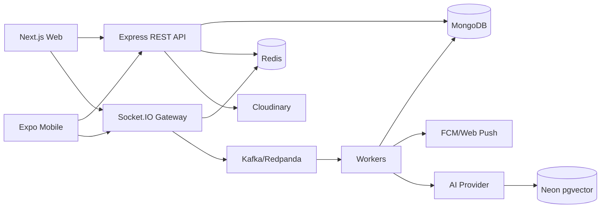
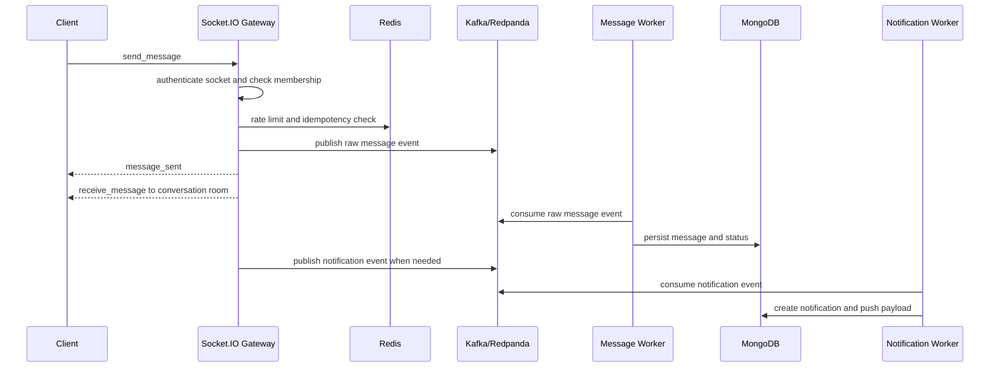

# Zync Platform

## Overview

Zync Platform là nền tảng giao tiếp thời gian thực được xây dựng theo mô hình monorepo TypeScript. Dự án gồm backend REST API, Socket.IO realtime gateway, Kafka/Redpanda workers, Next.js web app, Expo React Native mobile app, shared TypeScript contracts và local infrastructure.

Hệ thống hỗ trợ các luồng chính của một ứng dụng giao tiếp đa nền tảng: authentication, profile, friends, realtime chat, group/channel, community posts, notifications, WebRTC calls và các tính năng AI. Backend hiện được tổ chức theo modular monolith, trong đó từng domain được tách thành routes, controllers, services, schemas và models nhưng vẫn chạy trong cùng một Express application.

Zync tập trung vào trải nghiệm giao tiếp realtime trên web và mobile, đồng thời tích hợp AI vào workflow thực tế của ứng dụng chat như catch-up digest, assistant inbox, semantic search, group notes, reminders/tasks và moderation. Dự án lấy cảm hứng từ các nền tảng nhắn tin hiện đại nhưng được tài liệu hóa như một fullstack product codebase độc lập.

## Screenshots

### Landing Page

<!-- TODO: Paste landing page screenshot here -->

### Authentication

<!-- TODO: Paste authentication screenshot here -->

### Dashboard

<!-- TODO: Paste dashboard screenshot here -->

### Realtime Chat

<!-- TODO: Paste realtime chat screenshot here -->

### Friends and Groups

<!-- TODO: Paste friends/groups screenshot here -->

### Community

<!-- TODO: Paste community screenshot here -->

### Audio/Video Call

<!-- TODO: Paste call screenshot here -->

### AI Assistant

<!-- TODO: Paste AI assistant screenshot here -->

## Features

### Authentication and User Management

- Register with email OTP.
- Login with email/password and OTP verification.
- Forgot password flow.
- Google OAuth login if configured.
- JWT access token, refresh token and logout.
- Token blacklist/revocation.
- User profile, avatar, username, display name, skills, interests and developer role.
- Account settings and onboarding flow.

### Friends and Social Graph

- Search users by name, username or email.
- Send, accept and reject friend requests.
- Friend list and friend count.
- Block and unblock users.
- Public profile and quick profile preview.
- Presence and last-seen related data where supported.

### Realtime Messaging

- 1-1 and group conversations.
- Text, image, video, audio, file and sticker messages.
- Typing indicator.
- Sent, delivered and read statuses.
- Reply message.
- Recall message.
- Delete message for current user.
- Forward message.
- Message reactions.
- Idempotency key to reduce duplicate messages when retrying.
- Cursor-based message history.

### Groups and Channels

- Create and update groups.
- Add and remove members.
- Leave or delete groups.
- Admin/member role management.
- Public channel discovery and join flow.
- Member approval configuration for groups/channels.
- Group update events through Socket.IO.

### Community

- Post feed.
- Trending posts.
- Create and view posts.
- Update and delete own posts.
- Comments and reply data model.
- Like, bookmark and favorite actions.
- User/channel discovery.

### Notifications

- In-app notifications.
- Realtime notification event.
- Unread notification count.
- Mark as read and mark all as read.
- Notification preferences.
- Mute and pin conversations.
- Web Push and mobile push token support with FCM/VAPID configuration.

### Audio/Video Calling

- 1-1 audio/video call.
- Incoming and outgoing call UI.
- Accept, reject, end and missed call states.
- WebRTC offer/answer/ICE signaling through Socket.IO.
- Call session and participant state in backend.
- Ephemeral call token for protected signaling.
- TURN/coturn support for NAT traversal.
- Group call baseline exists in signaling/session code; production-grade group calling would require a dedicated SFU/media-plane design.

### AI Features

- AI Catch-up Digest for summarizing unread or recent conversation messages.
- AI Assistant Inbox for surfacing summaries, reminders, tasks, notes and search results.
- Semantic Search for finding messages by meaning using embeddings and vector search.
- Group Notes for generating structured notes from group conversations.
- AI reminders/tasks generated or managed from conversation context.
- Moderation modules using keyword filtering and AI review flow where configured.
- Prompt guard, AI rate limiting, model fallback, embedding cache and structured output validation where implemented.

## Tech Stack

| Layer | Technology | Purpose |
| --- | --- | --- |
| Language | TypeScript | Shared language for backend, web, mobile and packages. |
| Monorepo | npm workspaces | Manage apps and shared packages in one repository. |
| Backend | Node.js, Express | REST API, middleware, route mounting and domain modules. |
| Realtime | Socket.IO, Redis adapter | Chat, presence, notifications, reactions and WebRTC signaling. |
| Database | MongoDB, Mongoose | Primary business persistence for users, conversations, messages, posts, calls and notifications. |
| Cache/Presence/Rate Limit | Redis, ioredis | Presence, typing TTL, OTP, token blacklist, idempotency, cache and rate limiting. |
| Queue/Workers | KafkaJS, Redpanda | Async message persistence, notifications, embeddings and AI jobs. |
| Web | Next.js App Router, React, Tailwind CSS, Zustand | Web client, dashboard, chat and AI assistant UI. |
| Mobile | Expo Router, React Native, Zustand | Cross-platform mobile client. |
| Shared Contracts | `packages/shared-types` | Shared TypeScript contracts for models, socket payloads and AI payloads. |
| Media Upload | Cloudinary signed upload | Direct client upload using backend-generated signatures. |
| Notification | Firebase Cloud Messaging, Web Push | Mobile push and browser push notification support. |
| WebRTC | RTCPeerConnection, react-native-webrtc, Socket.IO signaling, TURN/coturn | Audio/video calling and NAT traversal. |
| AI/LLM | Gemini, OpenRouter depending on configuration | Summaries, assistant items, group notes, moderation and generation workflows. |
| Vector Search | Neon PostgreSQL, pgvector, embedding model | Semantic search over message content and AI search results. |
| DevOps/Staging | Docker Compose, PM2, Nginx, VPS runbook | Local infrastructure and manual staging deployment workflow. |

## Architecture

Zync uses a modular monolith backend. Each domain module is separated into routes, controllers, services, schemas and models, while shared infrastructure clients live under `apps/server/src/infrastructure`.

Socket.IO gateway authenticates sockets with JWT, joins users to private rooms, checks conversation membership before room access and delegates chat/call/reaction logic to sub-controllers. Redis is used for presence, typing TTL, idempotency, rate limiting and cache. Kafka/Redpanda is used for asynchronous jobs such as message persistence, notifications, message embeddings and AI catch-up jobs.

MongoDB is the primary business database. Neon pgvector is used for vector search when semantic search is enabled. Web and Mobile clients communicate with the same REST API and Socket.IO contracts, with shared TypeScript types placed in `packages/shared-types`.



## Project Structure

```text
zync-platform/
  apps/
    server/          Backend REST API, Socket.IO gateway and workers
    web/             Next.js web application
    mobile/          Expo React Native mobile application
  packages/
    shared-types/    Shared TypeScript contracts
  infra/             Docker Compose local infrastructure
  docs/              Technical documentation
  package.json       Root workspace scripts
```

`apps/server` contains the Express application, Socket.IO gateway, domain modules, infrastructure adapters, workers, tests and seed scripts.

`apps/web` contains the Next.js App Router application, dashboard pages, feature components, hooks, Zustand state and service layer for REST/socket calls.

`apps/mobile` contains the Expo Router app, mobile screens, services, hooks, stores, reusable UI components and WebRTC/push integration code.

`packages/shared-types` contains TypeScript contracts shared across server, web and mobile.

`infra` contains Docker Compose configuration for local Redis, Redpanda, Redpanda Console and coturn.

`docs` contains technical context, API/socket notes, AI handoff documents, design assets and deployment runbooks.

## Main Workflows

### Realtime Message Flow

1. Client sends `send_message` through Socket.IO.
2. Server authenticates the socket and checks conversation membership.
3. Server validates payload, rate limit and idempotency key.
4. Message is emitted to the conversation room in realtime.
5. Kafka/Redpanda receives a raw message event.
6. Message worker persists message and status into MongoDB.
7. Notification worker creates notification or push event when needed.



### Media Upload Flow

1. Client requests upload signature from backend.
2. Backend returns signed Cloudinary upload parameters.
3. Client uploads file directly to Cloudinary.
4. Client verifies uploaded media through backend.
5. Client sends final media message.

### WebRTC Call Flow

1. Caller creates or sends call invite.
2. Callee receives incoming call event.
3. Callee accepts or rejects.
4. WebRTC offer/answer/ICE candidates are exchanged through Socket.IO.
5. Media stream flows through peer connection.
6. TURN server is used when direct connection is not possible.
7. Call end/missed/rejected state is saved and synchronized.

### AI Workflow

1. Conversation messages are selected based on the AI feature.
2. The request is guarded, rate-limited and prepared.
3. AI job may be queued through Kafka/Redpanda.
4. Worker calls AI provider or embedding model.
5. Structured output is validated.
6. Result is saved to MongoDB or vector database depending on feature.
7. Client receives realtime update through AI socket events.

## AI Integration

AI features in Zync are integrated into product workflows instead of being isolated demos. The AI layer works with conversation messages, unread state, assistant inbox items, group note records, reminders/tasks, moderation records and vector search results.

Catch-up summarizes unread or recent conversation messages into a compact digest. Semantic Search converts messages and queries into embedding vectors and searches by vector similarity. Group Notes turns conversation context into structured notes with decisions, open questions and action items. Reminders/tasks can be generated or managed from conversation context. Moderation combines deterministic keyword rules and AI review flow where configured.

The system includes supporting layers such as prompt guard, rate limit, model fallback, embedding cache, async workers and structured output parsing/validation where implemented. AI features require external environment variables and provider configuration.

Semantic Search can be understood as follows:

- Exact search only finds matching keywords.
- Semantic search converts content into embedding vectors.
- Sentences with similar meaning have nearby vectors.
- Vectors are stored in pgvector so related messages can be retrieved by meaning, not only by exact words.

## Getting Started

### Prerequisites

- Node.js >= 20.
- npm >= 10.
- Docker and Docker Compose.
- MongoDB connection string.
- Cloudinary account.
- Optional: AI provider key and Neon database.
- Optional: Firebase/Web Push configuration.

### Installation

```bash
git clone <repo-url>
cd zync-platform
npm install
cp .env.example .env
```

### Start Local Infrastructure

```bash
npm run docker:up
```

Local Docker stack includes Redis, Redpanda, Redpanda Console and coturn depending on compose configuration. Redpanda is Kafka-compatible and used as a lightweight local Kafka replacement.

### Start Development Apps

```bash
npm run dev:server
npm run dev:web
npm run dev:mobile
```

### Health Check

```bash
curl http://localhost:3000/health
```

## Environment Variables

Do not commit `.env`. Use `.env.example` as the template and fill values for local, staging or production environments.

`NEXT_PUBLIC_*` and `EXPO_PUBLIC_*` variables are public client-side variables and must not contain secrets.

| Group | Variables |
| --- | --- |
| App | `NODE_ENV`, `PORT`, `HOST`, `CORS_ORIGINS` |
| Database | `MONGODB_URI` |
| Redis | `REDIS_URL` |
| Kafka | `KAFKA_ENABLED`, `KAFKA_BROKERS`, `KAFKA_GROUP_ID`, `KAFKA_SASL_USERNAME`, `KAFKA_SASL_PASSWORD` |
| JWT | `JWT_SECRET`, `JWT_REFRESH_SECRET`, `JWT_ACCESS_EXPIRY`, `JWT_REFRESH_EXPIRY`, `COOKIE_SAME_SITE` |
| OTP/Email | `OTP_HARDCODE`, `OTP_HARDCODE_VALUE`, `OTP_RATE_LIMIT_MAX`, `OTP_RATE_LIMIT_WINDOW_SECONDS`, `OTP_EMAIL_PROVIDER`, `RESEND_API_KEY`, `RESEND_FROM`, `SMTP_HOST`, `SMTP_PORT`, `SMTP_SECURE`, `SMTP_USER`, `SMTP_PASS`, `SMTP_FROM` |
| Cloudinary | `CLOUDINARY_CLOUD_NAME`, `CLOUDINARY_API_KEY`, `CLOUDINARY_API_SECRET`, `CLOUDINARY_UPLOAD_PRESET`, `STICKER_CDN_URL` |
| Web | `NEXT_PUBLIC_API_URL`, `NEXT_PUBLIC_WS_URL`, `NEXT_PUBLIC_GOOGLE_CLIENT_ID`, `NEXT_PUBLIC_VAPID_PUBLIC_KEY`, `NEXT_PUBLIC_TURN_URLS`, `NEXT_PUBLIC_TURN_USERNAME`, `NEXT_PUBLIC_TURN_PASSWORD` |
| Mobile | `EXPO_PUBLIC_API_URL`, `EXPO_PUBLIC_SOCKET_URL`, `EXPO_PUBLIC_TURN_URLS`, `EXPO_PUBLIC_TURN_USERNAME`, `EXPO_PUBLIC_TURN_PASSWORD` |
| Notification | `FCM_SERVICE_ACCOUNT_JSON`, `GOOGLE_APPLICATION_CREDENTIALS`, `VAPID_PUBLIC_KEY`, `VAPID_PRIVATE_KEY`, `VAPID_SUBJECT` |
| AI | `AI_PROVIDER`, `GEMINI_API_KEY`, `OPENROUTER_API_KEY`, `OPENROUTER_BASE_URL`, `OPENROUTER_MODEL`, `OPENROUTER_FALLBACK_MODEL`, `NEON_DATABASE_URL`, `AI_MODEL_PRIMARY`, `AI_MODEL_FALLBACK`, `AI_EMBEDDING_MODEL`, `AI_RATE_LIMIT_PER_MINUTE`, `AI_MODERATION_ENABLED`, `AI_ASSISTANT_ENABLED`, `AI_SEARCH_ENABLED` |
| WebRTC/TURN | `TURN_REALM`, `TURN_URLS`, `TURN_USERNAME`, `TURN_PASSWORD`, `CALL_EPHEMERAL_TOKEN_SECRET`, `CALL_EPHEMERAL_TOKEN_TTL_SECONDS`, `CALL_RING_TIMEOUT_MS`, `CALL_CONNECTED_STALE_MS` |

## Available Scripts

| Script | Description |
| --- | --- |
| `npm run dev:server` | Start backend in development mode. |
| `npm run dev:web` | Start Next.js web app. |
| `npm run dev:mobile` | Start Expo mobile app. |
| `npm run docker:up` | Start local infrastructure. |
| `npm run docker:down` | Stop local infrastructure. |
| `npm run docker:logs` | Follow Docker logs. |
| `npm run typecheck` | Run TypeScript checks across workspaces. |
| `npm run test` | Run tests where available. |
| `npm run lint` | Run lint where available. |
| `npm run build` | Build all workspaces. |

## Testing and Verification

```bash
npm run typecheck
npm run test
npm run lint
npm run build
```

Workspace-level checks:

```bash
npm run typecheck --workspace=apps/server
npm run typecheck --workspace=apps/web
npm run typecheck --workspace=apps/mobile
```

API/socket contract changes should be verified across server, web and mobile. Realtime, call, auth and AI workflows should be tested carefully because they affect cross-client state.

## Deployment

Project can be deployed to a VPS/Lightsail-style environment. Nginx can be used as an HTTPS reverse proxy, PM2 can run server and web processes, and Docker can run Redpanda/coturn for staging if needed.

Production should use managed or hardened services for MongoDB, Redis, Kafka/Redpanda, TURN, storage, notification and AI. Mobile builds must use public API/socket URLs.

Deployment documentation:

- [docs/deploy/staging-vps.md](docs/deploy/staging-vps.md)

## Current Status

| Area | Status | Notes |
| --- | --- | --- |
| Authentication | Implemented with external configuration required | Email OTP, password login, refresh/logout and Google OAuth are present; email/OAuth providers require environment setup. |
| Web app | Implemented | Next.js app includes landing, auth, dashboard, chat, friends, community, notifications, profile and AI assistant related screens/services. |
| Mobile app | Partial | Expo app includes auth, tabs, chat, community, notifications and call screens; AI feature parity should be verified per screen. |
| Realtime chat | Implemented | Socket events cover send, receive, typing, delivery/read status, recall, delete, forward and reactions. |
| Groups/channels | Implemented | Private groups, public channel discovery/join and group update events are present. |
| Community | Implemented | Feed, trending, post CRUD, comments, views, likes, bookmarks and favorites are implemented. |
| Notifications | Implemented with external configuration required | In-app notification flow is present; browser/mobile push requires VAPID/FCM configuration. |
| WebRTC calling | Requires production hardening | 1-1 and baseline group signaling/session flows are present; production TURN/SFU/media-plane hardening is still required. |
| AI features | Implemented with external configuration required | Catch-up, assistant inbox, reminders/tasks, semantic search, group notes and moderation modules depend on provider, vector database and worker configuration. |
| Deployment | Partial | Manual VPS staging runbook exists; production CI/CD, observability, backup and managed infrastructure should be expanded. |

## Limitations

- Some features require external provider configuration.
- AI features depend on provider quota, vector database setup and worker configuration.
- Production group calling may require SFU architecture if the current implementation remains mesh/baseline.
- Production deployment should add stronger CI/CD, monitoring, backup and security hardening.
- Some REST/socket contracts can be further standardized through shared types.

## Roadmap

- Improve production security for auth/session handling.
- Expand shared TypeScript contracts for REST and Socket.IO events.
- Add more integration tests for realtime, call and AI workflows.
- Improve observability with structured logs and dashboards.
- Harden TURN/WebRTC deployment.
- Improve mobile parity for AI features.
- Add CI/CD pipeline and automated deployment.

## License

This project is currently used for learning, portfolio and demonstration purposes. License information will be updated later.

## Author

- Name: <your-name>
- GitHub: <your-github-url>
- Email: <your-email>
