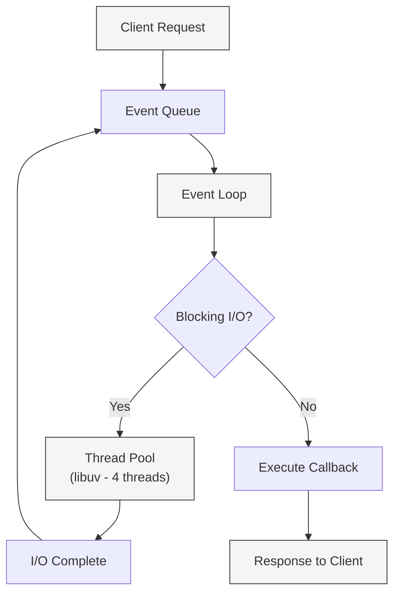
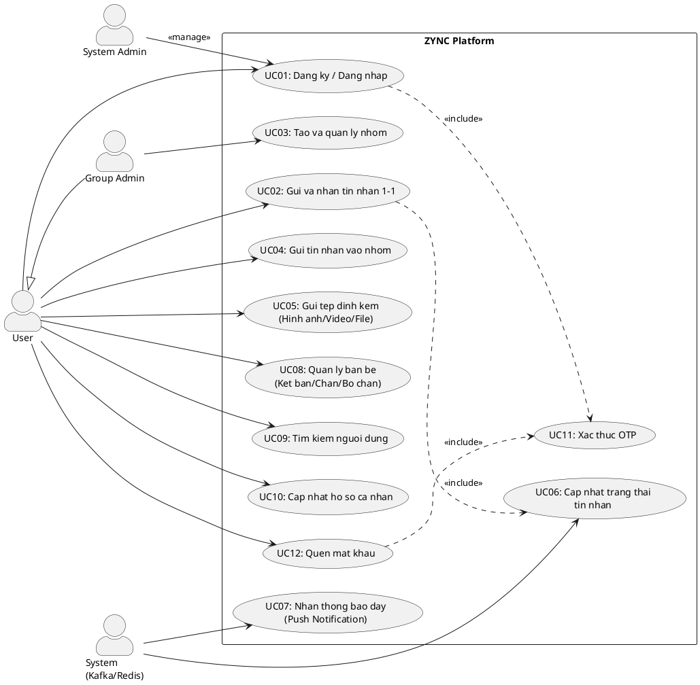
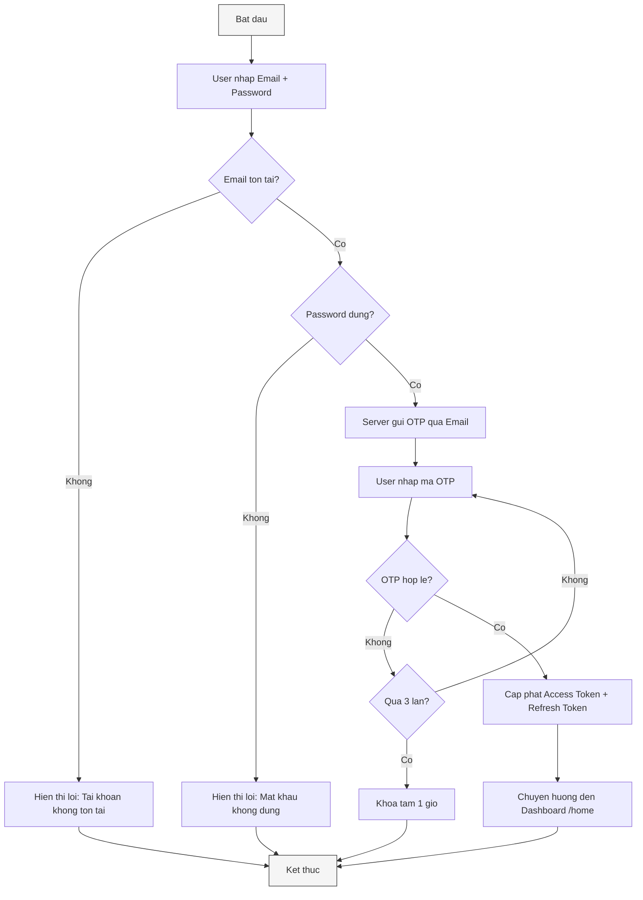
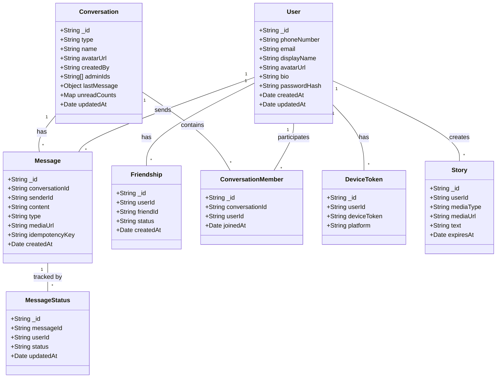
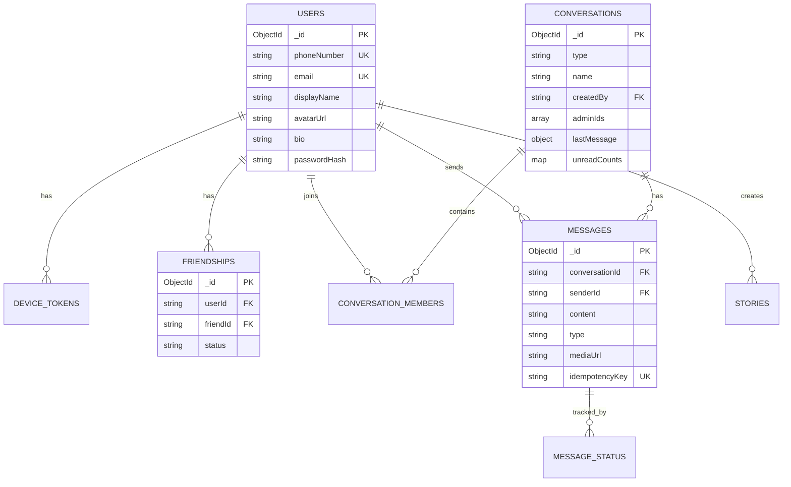
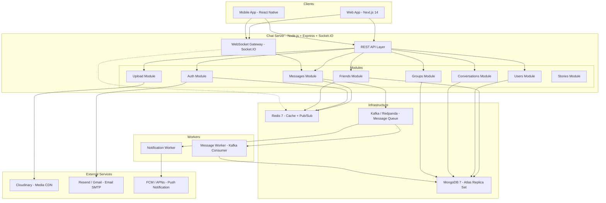
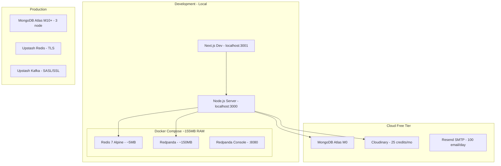
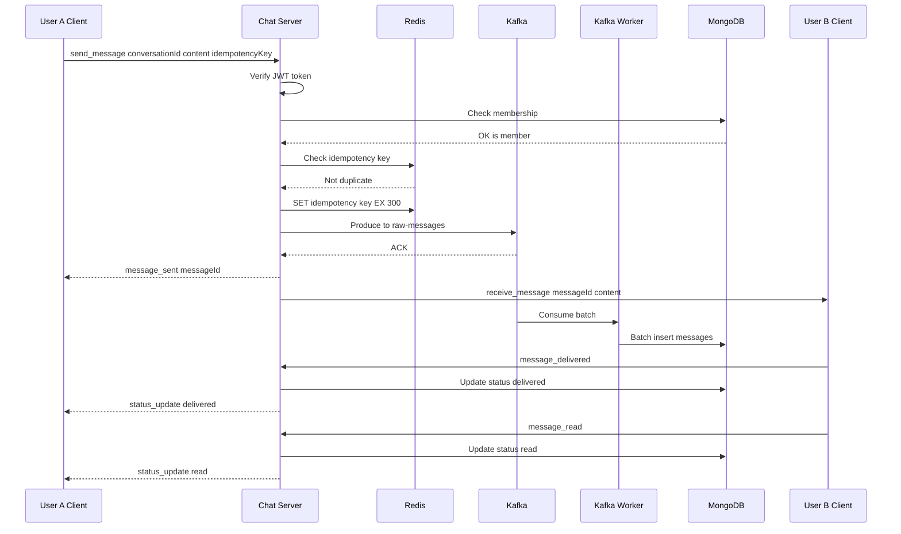
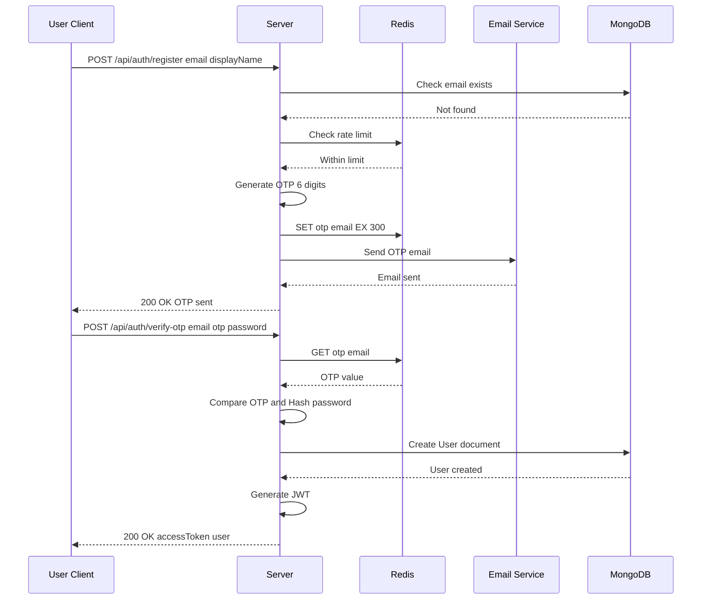

<div align="center">

**BỘ CÔNG THƯƠNG**

**TRƯỜNG ĐẠI HỌC CÔNG NGHIỆP TP.HCM**

**KHOA CÔNG NGHỆ THÔNG TIN**

---

# BÁO CÁO ĐỒ ÁN MÔN HỌC

## CÔNG NGHỆ MỚI TRONG PHÁT TRIỂN ỨNG DỤNG CNTT

### ĐỀ TÀI: XÂY DỰNG HỆ THỐNG NHẮN TIN THỜI GIAN THỰC ZYNC PLATFORM

---

**Nhóm 08 – Sinh viên thực hiện:**

| STT | Họ và tên | MSSV |
|:---:|-----------|:----:|
| 1 | Nguyễn Thanh Bình | 22660171 |
| 2 | Nguyễn Minh Du | 22680791 |
| 3 | Bùi Quang Minh | 22664411 |
| 4 | Dương Nhật Anh | 22728821 |

**Giảng viên hướng dẫn:** *(Điền tên GVHD)*

**TP. Hồ Chí Minh, tháng 04 năm 2026**

</div>

---

<div align="center">

## NHẬN XÉT CỦA GIẢNG VIÊN

</div>

| | |
|---|---|
| **Giảng viên hướng dẫn:** | *(Điền tên GVHD)* |
| **Nhóm sinh viên:** | Nhóm 08 |
| **Đề tài:** | Xây dựng Hệ thống Nhắn tin Thời gian thực ZYNC Platform |

**Nhận xét:**

....................................................................................................................................

....................................................................................................................................

....................................................................................................................................

....................................................................................................................................

....................................................................................................................................

....................................................................................................................................

**Điểm đánh giá:** ............ / 10

| | |
|---|---|
| **Ngày .... tháng .... năm 2026** | |
| **Chữ ký Giảng viên** | |
| | |
| | |

---

## MỤC LỤC

- [MỤC LỤC](#mục-lục)
- [DANH MỤC CÁC HÌNH VẼ](#danh-mục-các-hình-vẽ)
- [DANH MỤC CÁC BẢNG BIỂU](#danh-mục-các-bảng-biểu)
- [CHƯƠNG 1: GIỚI THIỆU](#chương-1-giới-thiệu)
  - [1.1 Tổng quan](#11-tổng-quan)
  - [1.2 Mục tiêu đề tài](#12-mục-tiêu-đề-tài)
  - [1.3 Phạm vi đề tài](#13-phạm-vi-đề-tài)
  - [1.4 Mô tả yêu cầu chức năng](#14-mô-tả-yêu-cầu-chức-năng)
  - [1.5 Yêu cầu phi chức năng](#15-yêu-cầu-phi-chức-năng)
- [CHƯƠNG 2: CƠ SỞ LÝ THUYẾT](#chương-2-cơ-sở-lý-thuyết)
  - [2.1 Node.js và Express.js](#21-nodejs-và-expressjs)
  - [2.2 MongoDB (NoSQL Database)](#22-mongodb-nosql-database)
  - [2.3 Redis (In-Memory Data Store)](#23-redis-in-memory-data-store)
  - [2.4 Apache Kafka (Message Broker)](#24-apache-kafka-message-broker)
  - [2.5 Socket.IO (WebSocket)](#25-socketio-websocket)
  - [2.6 Next.js (React Framework)](#26-nextjs-react-framework)
  - [2.7 React Native (Mobile Framework)](#27-react-native-mobile-framework)
  - [2.8 Cloudinary (Media Storage & CDN)](#28-cloudinary-media-storage--cdn)
  - [2.9 JSON Web Token (JWT)](#29-json-web-token-jwt)
  - [2.10 Docker & Containerization](#210-docker--containerization)
- [CHƯƠNG 3: PHÂN TÍCH VÀ THIẾT KẾ](#chương-3-phân-tích-và-thiết-kế)
  - [3.1 Phân tích yêu cầu bằng UML](#31-phân-tích-yêu-cầu-bằng-uml)
  - [3.2 Thiết kế cơ sở dữ liệu](#32-thiết-kế-cơ-sở-dữ-liệu)
  - [3.3 Architecture Diagram](#33-architecture-diagram)
  - [3.4 Deployment Diagram](#34-deployment-diagram)
  - [3.5 Sequence Diagram](#35-sequence-diagram)
- [CHƯƠNG 4: HIỆN THỰC](#chương-4-hiện-thực)
  - [4.1 Cấu hình phần cứng, phần mềm](#41-cấu-hình-phần-cứng-phần-mềm)
  - [4.2 Cấu trúc mã nguồn](#42-cấu-trúc-mã-nguồn)
  - [4.3 Giao diện hệ thống](#43-giao-diện-hệ-thống)
  - [4.4 Kế hoạch và hiện thực kiểm thử](#44-kế-hoạch-và-hiện-thực-kiểm-thử)
- [CHƯƠNG 5: KẾT LUẬN](#chương-5-kết-luận)
  - [5.1 Kết quả đạt được](#51-kết-quả-đạt-được)
  - [5.2 Hạn chế của đồ án](#52-hạn-chế-của-đồ-án)
  - [5.3 Hướng phát triển](#53-hướng-phát-triển)
- [TÀI LIỆU THAM KHẢO](#tài-liệu-tham-khảo)

---

## DANH MỤC CÁC HÌNH VẼ

| STT | Tên hình | Trang |
|:---:|----------|:-----:|
| Hình 2.1 | Kiến trúc Event-driven của Node.js | ... |
| Hình 2.2 | Mô hình Document-oriented của MongoDB | ... |
| Hình 2.3 | Cơ chế Pub/Sub của Redis | ... |
| Hình 2.4 | Luồng xử lý tin nhắn qua Kafka | ... |
| Hình 2.5 | Giao thức WebSocket hai chiều | ... |
| Hình 3.1 | Use Case Diagram tổng quát | ... |
| Hình 3.2 | Class Diagram hệ thống | ... |
| Hình 3.3 | Architecture Diagram | ... |
| Hình 3.4 | Deployment Diagram | ... |
| Hình 3.5 | Sequence Diagram – Gửi tin nhắn 1-1 | ... |
| Hình 3.6 | Sequence Diagram – Đăng ký & Xác thực OTP | ... |
| Hình 3.7 | Sequence Diagram – Tạo nhóm chat | ... |
| Hình 3.8 | Activity Diagram – Luồng đăng nhập | ... |
| Hình 3.9 | ERD – Quan hệ các Collections MongoDB | ... |
| Hình 4.1 | Giao diện Landing Page | ... |
| Hình 4.2 | Giao diện Đăng nhập / Đăng ký | ... |
| Hình 4.3 | Giao diện Dashboard chính | ... |
| Hình 4.4 | Giao diện Chat 1-1 | ... |
| Hình 4.5 | Giao diện Quản lý bạn bè | ... |
| Hình 4.6 | Giao diện Profile người dùng | ... |

---

## DANH MỤC CÁC BẢNG BIỂU

| STT | Tên bảng | Trang |
|:---:|----------|:-----:|
| Bảng 1.1 | Danh sách yêu cầu chức năng | ... |
| Bảng 1.2 | Yêu cầu phi chức năng | ... |
| Bảng 3.1 | Danh sách tác nhân và mô tả | ... |
| Bảng 3.2 | Danh sách Use Case | ... |
| Bảng 3.3 | Đặc tả Use Case UC01 – Đăng ký tài khoản | ... |
| Bảng 3.4 | Đặc tả Use Case UC02 – Gửi tin nhắn 1-1 | ... |
| Bảng 3.5 | Đặc tả Use Case UC03 – Tạo và quản lý nhóm | ... |
| Bảng 3.6 | Đặc tả Use Case UC05 – Gửi media | ... |
| Bảng 3.7 | Cấu trúc Collections MongoDB | ... |
| Bảng 3.8 | Redis Key Schema | ... |
| Bảng 3.9 | Socket.IO Events Contract | ... |
| Bảng 3.10 | REST API Endpoints | ... |
| Bảng 4.1 | Cấu hình môi trường phát triển | ... |
| Bảng 4.2 | Biến môi trường hệ thống | ... |
| Bảng 4.3 | Kết quả kiểm thử chức năng | ... |

---

## CHƯƠNG 1: GIỚI THIỆU

### 1.1 Tổng quan

Trong thời đại số hóa hiện nay, nhu cầu giao tiếp trực tuyến theo thời gian thực (real-time) ngày càng trở nên thiết yếu đối với cả cá nhân và doanh nghiệp. Tuy nhiên, việc phụ thuộc vào các ứng dụng nhắn tin thương mại bên thứ ba thường đi kèm với những rủi ro về bảo mật dữ liệu, quyền riêng tư và chi phí duy trì đối với các tổ chức lớn.

Nhận thấy vấn đề này, nhóm chúng em quyết định thực hiện đề tài nghiên cứu và xây dựng **ZYNC Platform** – một ứng dụng nhắn tin thời gian thực phiên bản 2.0 (Production-Grade). ZYNC Platform được thiết kế dựa trên kiến trúc **Scaled Modular Monolith**, hướng tới Microservices trong tương lai. Hệ thống không chỉ đáp ứng nhu cầu nhắn tin cơ bản mà còn tích hợp các công nghệ hiện đại như **Apache Kafka**, **Redis** và **MongoDB** để đảm bảo hiệu suất cao, khả năng mở rộng linh hoạt và quản lý dữ liệu nội bộ an toàn.

Hệ thống hỗ trợ quy mô vài nghìn người dùng đồng thời, với các tính năng bao gồm chat 1-1, nhóm, chia sẻ media, story 24h và quản lý bạn bè. Mục tiêu là thay thế ứng dụng chat thương mại với khả năng kiểm soát dữ liệu nội bộ và tối ưu chi phí vận hành.

### 1.2 Mục tiêu đề tài

Đồ án được thực hiện với các mục tiêu chính sau đây:

1. **Cung cấp giải pháp thay thế:** Xây dựng một nền tảng nhắn tin nội bộ mạnh mẽ, có khả năng thay thế các ứng dụng chat thương mại hiện có trên thị trường đối với quy mô doanh nghiệp vừa và nhỏ.

2. **Kiểm soát dữ liệu:** Đảm bảo toàn bộ dữ liệu tin nhắn, tệp tin đính kèm được lưu trữ và quản lý tập trung, bảo mật tuyệt đối thông tin nội bộ.

3. **Tối ưu chi phí và hiệu năng:** Ứng dụng các công nghệ mã nguồn mở và kiến trúc hiện đại để giảm thiểu chi phí vận hành hạ tầng trong khi vẫn đảm bảo khả năng chịu tải cao.

4. **Khả năng mở rộng (Scalability):** Thiết kế hệ thống theo hướng Modular Monolith, tạo tiền đề dễ dàng chuyển đổi sang Microservices khi lượng người dùng tăng đột biến.

5. **Đa nền tảng (Cross-platform):** Phát triển đồng thời trên Web (Next.js) và Mobile (React Native) với trải nghiệm người dùng nhất quán.

### 1.3 Phạm vi đề tài

Phạm vi của đồ án tập trung vào việc phát triển hoàn chỉnh một hệ sinh thái nhắn tin bao gồm:

- **Phía Backend (Server):** Xây dựng REST API và dịch vụ xử lý thời gian thực sử dụng Node.js + Express.js + Socket.IO, kết hợp với MongoDB (persistence), Redis (cache/pub-sub) và Apache Kafka (message queue).

- **Phía Frontend Web:** Phát triển giao diện người dùng trên nền tảng Web sử dụng framework Next.js 14 (App Router), tối ưu hóa SEO và trải nghiệm người dùng (UX/UI) với Atomic Design pattern.

- **Phía Mobile:** Xây dựng ứng dụng di động đa nền tảng (iOS/Android) bằng React Native + Expo.

- **Tích hợp dịch vụ bên thứ ba:**
  - **Cloudinary:** Lưu trữ và phân phối tệp tin đa phương tiện (hình ảnh, video, tài liệu) thông qua CDN toàn cầu.
  - **Resend / Gmail SMTP:** Gửi email OTP xác thực người dùng.
  - **Firebase Cloud Messaging (FCM) / APNs:** Push notification cho Android/iOS/Web.

### 1.4 Mô tả yêu cầu chức năng

Hệ thống ZYNC Platform được thiết kế để đáp ứng các yêu cầu chức năng cốt lõi sau:

**Bảng 1.1 – Danh sách yêu cầu chức năng**

| Mã | Chức năng | Mô tả chi tiết |
|:--:|-----------|----------------|
| F1 | Đăng ký tài khoản | Đăng ký bằng email/SĐT, xác thực OTP qua email/SMS, tạo mật khẩu |
| F2 | Đăng nhập | Đăng nhập email + password + OTP, đăng nhập Google, refresh token tự động |
| F3 | Quên mật khẩu | Gửi OTP khôi phục theo email/SĐT, xác thực và đặt lại mật khẩu mới |
| F4 | Quản lý hồ sơ | Cập nhật tên, avatar, bio; upload avatar qua Cloudinary với progress bar |
| F5 | Gửi lời mời kết bạn | Tìm kiếm user theo tên/email/SĐT, gửi lời mời kết bạn |
| F6 | Chấp nhận/Từ chối kết bạn | Xem danh sách lời mời đến/đi, chấp nhận hoặc từ chối |
| F7 | Hủy kết bạn | Xóa quan hệ bạn bè đã được chấp nhận |
| F8 | Chặn/Bỏ chặn người dùng | Chặn user không cho gửi tin nhắn hoặc lời mời kết bạn |
| F9 | Danh sách bạn bè | Hiển thị danh sách bạn bè với cursor-based pagination, cache Redis 10 phút |
| F10 | Tạo nhóm chat | Tạo nhóm tối đa 100 thành viên, đặt tên và avatar nhóm |
| F11 | Cập nhật thông tin nhóm | Admin cập nhật tên, avatar, mô tả nhóm |
| F12 | Thêm/Xóa thành viên | Admin thêm hoặc xóa thành viên khỏi nhóm |
| F13 | Rời nhóm | Thành viên tự rời khỏi nhóm chat |
| F14 | Phân quyền admin | Chuyển quyền admin cho thành viên khác |
| F15 | Xóa/Giải tán nhóm | Admin có quyền giải tán nhóm vĩnh viễn |
| F16 | Thông báo nhóm realtime | Phát sự kiện `group_updated` qua Socket.IO khi có thay đổi |
| F17 | Nhắn tin 1-1 realtime | Gửi/nhận tin nhắn văn bản + emoji theo thời gian thực qua WebSocket |
| F18 | Nhắn tin nhóm realtime | Gửi tin nhắn vào nhóm, broadcast đến tất cả thành viên |
| F19 | Gửi media (ảnh/video/file) | Upload qua Cloudinary signed URL, gửi tin nhắn kèm mediaUrl |
| F20 | Trạng thái tin nhắn | Hiển thị sent → delivered → read (2 tick xanh) theo thời gian thực |
| F21 | Typing indicator | Hiển thị "đang gõ..." với TTL 3 giây trong Redis |
| F22 | Tìm kiếm bạn bè | Tìm kiếm theo tên/SĐT/email trên thanh search Dashboard |
| F23 | Xem profile nhanh | Modal xem nhanh thông tin người dùng từ kết quả tìm kiếm |
| F24 | Hiển thị online/offline | *(Đang phát triển)* Tracking presence qua Redis heartbeat 30s |
| F25 | Story 24h | *(Đang phát triển)* Đăng story text/ảnh tự hủy sau 24 giờ (TTL index) |
| F26 | Push notification | *(Đang phát triển)* Thông báo khi có tin nhắn mới + user offline (FCM/APNs) |

### 1.5 Yêu cầu phi chức năng

**Bảng 1.2 – Yêu cầu phi chức năng**

| Tiêu chí | Yêu cầu | Ghi chú |
|----------|---------|---------|
| **Latency** | Tin nhắn < 200ms (p95 < 500ms) | Đo từ lúc gửi đến lúc nhận trên client |
| **Scalability** | 500+ CCU/instance | Scale ngang không downtime bằng Redis adapter |
| **Availability** | 99.9% uptime | Replica Set MongoDB 3 node, Kafka 3+ partition |
| **Security** | JWT HS256, HTTPS/WSS bắt buộc | Rate limiting OTP 3 lần/giờ, blacklist token |
| **Test Coverage** | > 80% unit test | Jest + React Testing Library |
| **Responsiveness** | Responsive Desktop + Mobile | Giao diện tương thích từ 320px đến 2560px |

---

## CHƯƠNG 2: CƠ SỞ LÝ THUYẾT

### 2.1 Node.js và Express.js

**Node.js** là một môi trường chạy mã JavaScript đa nền tảng, mã nguồn mở, được xây dựng trên engine V8 của Google Chrome. Điểm mạnh lớn nhất của Node.js là kiến trúc **hướng sự kiện (Event-driven)** và cơ chế **I/O không đồng bộ (Non-blocking I/O)**. Điều này làm cho Node.js trở thành lựa chọn hoàn hảo cho các ứng dụng yêu cầu xử lý dữ liệu thời gian thực với số lượng kết nối đồng thời lớn.

Trong ZYNC Platform, Node.js (v20 LTS) đóng vai trò là core backend, xử lý các kết nối WebSocket (thông qua thư viện Socket.IO) để truyền tải tin nhắn tức thời giữa các client. **Express.js** (v4.19) được sử dụng làm HTTP framework, cung cấp hệ thống routing, middleware pipeline và error handling chuẩn hóa.

> **Code vẽ sơ đồ Event Loop Node.js (Mermaid):**



### 2.2 MongoDB (NoSQL Database)

**MongoDB** là cơ sở dữ liệu NoSQL hướng tài liệu (Document-oriented), lưu trữ dữ liệu dưới dạng JSON/BSON. Đối với ứng dụng chat, cấu trúc dữ liệu tin nhắn thường không đồng nhất và thay đổi linh hoạt – MongoDB cho phép truy vấn lịch sử tin nhắn nhanh chóng và dễ dàng mở rộng theo chiều ngang (Horizontal Scaling).

Trong ZYNC Platform, MongoDB 7 được sử dụng làm cơ sở dữ liệu chính thông qua **Mongoose ODM** (v8.3). Hệ thống triển khai trên **MongoDB Atlas** với cấu hình Replica Set, đảm bảo tính sẵn sàng cao và khả năng failover tự động.

**Các collections chính:**

| Collection | Mục đích | Index quan trọng |
|-----------|---------|-----------------|
| `users` | Thông tin người dùng | `phoneNumber` (unique), `email` (unique sparse) |
| `device_tokens` | Token thiết bị cho push notification | `deviceToken` (unique), `userId` |
| `friendships` | Quan hệ bạn bè & chặn | `{userId, friendId}` (unique), `status` |
| `conversations` | Hội thoại 1-1 và nhóm | `lastMessage.sentAt`, `updatedAt` |
| `conversation_members` | Thành viên hội thoại | `{conversationId, userId}` (unique) |
| `messages` | Tin nhắn | `{conversationId, createdAt: -1}`, `idempotencyKey` (unique) |
| `message_status` | Trạng thái tin nhắn | `{messageId, userId}` (unique) |
| `stories` | Story 24h | `expiresAt` (TTL index), `userId` |

### 2.3 Redis (In-Memory Data Store)

**Redis** (Remote Dictionary Server) là hệ thống lưu trữ dữ liệu trong bộ nhớ (in-memory), hỗ trợ nhiều cấu trúc dữ liệu như String, Hash, Set, Sorted Set. Trong ZYNC Platform, Redis 7 được sử dụng với ba vai trò chính:

1. **Pub/Sub:** Đồng bộ sự kiện real-time giữa nhiều Chat Server instance thông qua `@socket.io/redis-adapter`.
2. **Cache:** Lưu cache danh sách bạn bè (TTL 10 phút), danh sách hội thoại (TTL 5 phút) để giảm tải MongoDB.
3. **Ephemeral Data:** Lưu trữ OTP (TTL 5 phút), typing indicator (TTL 3 giây), presence tracking (heartbeat 30 giây), JWT blacklist, rate limit counter.

**Bảng 3.8 – Redis Key Schema**

| Key Pattern | Kiểu | TTL | Mục đích |
|-------------|------|-----|---------|
| `user:{userId}:conversations` | String (JSON) | 5 phút | Cache danh sách hội thoại |
| `online_users` | Hash | 30 giây/field | Presence tracking |
| `typing:{convId}:{userId}` | String | 3 giây | Typing indicator |
| `idempotency:{key}` | String | 5 phút | Chống gửi trùng tin nhắn |
| `friends:{userId}` | String (JSON) | 10 phút | Cache danh sách bạn bè |
| `otp:{phoneOrEmail}` | String | 5 phút | Mã OTP xác thực |
| `otp_rl:ip:{ip}` | String | 1 giờ | Rate limit OTP theo IP |
| `otp_rl:id:{identifier}` | String | 1 giờ | Rate limit OTP theo SĐT/Email |
| `blacklist:token:{jti}` | String | = token expiry | Thu hồi JWT |

### 2.4 Apache Kafka (Message Broker)

**Apache Kafka** là nền tảng streaming sự kiện phân tán, được thiết kế để xử lý hàng triệu sự kiện mỗi giây với độ tin cậy cao. Trong ZYNC Platform, Kafka đóng vai trò **message buffer** giữa Socket.IO server và MongoDB:

- Khi user gửi tin nhắn, server đẩy message vào Kafka topic `raw-messages` thay vì ghi trực tiếp vào DB.
- Kafka Consumer (Worker) đọc batch message và insert vào MongoDB, đảm bảo **durability** – không mất tin nhắn khi DB chậm hoặc tạm thời không khả dụng.
- Hệ thống có cơ chế **fallback**: nếu Kafka consumer gặp lỗi, gateway tự động chuyển sang ghi trực tiếp MongoDB và giảm rate limit.

Trong môi trường phát triển, nhóm sử dụng **Redpanda** – một broker tương thích 100% Kafka API nhưng không cần Zookeeper, tiêu tốn chỉ ~150MB RAM (so với Kafka + ZK cần 600MB+). Code `kafkajs` hoạt động không cần thay đổi.

### 2.5 Socket.IO (WebSocket)

**Socket.IO** là thư viện JavaScript hỗ trợ giao tiếp hai chiều theo thời gian thực giữa client và server. Socket.IO tự động fallback từ WebSocket xuống HTTP long-polling khi WebSocket không khả dụng, đảm bảo tương thích trên mọi trình duyệt.

Trong ZYNC Platform, Socket.IO (v4.7) được sử dụng cho:
- Gửi/nhận tin nhắn tức thời
- Typing indicator (đang gõ)
- Trạng thái tin nhắn (sent/delivered/read)
- Presence tracking (online/offline)
- Thông báo nhóm real-time

Hệ thống sử dụng `@socket.io/redis-adapter` để đồng bộ sự kiện giữa nhiều server instance, cho phép scale ngang mà không mất kết nối.

### 2.6 Next.js (React Framework)

**Next.js 14** (App Router) được sử dụng làm framework cho ứng dụng Web. Next.js cung cấp Server-Side Rendering (SSR), Static Site Generation (SSG) và Client-Side Rendering (CSR), giúp tối ưu SEO và tốc độ tải trang.

Giao diện Web áp dụng **Atomic Design Pattern** (Atoms → Molecules → Organisms → Templates → Pages) để tổ chức component có hệ thống. State management sử dụng **Zustand** cho global state nhẹ và hiệu quả.

### 2.7 React Native (Mobile Framework)

**React Native** kết hợp **Expo** được sử dụng để phát triển ứng dụng di động đa nền tảng (iOS/Android). Ứng dụng mobile chia sẻ chung backend API và Socket.IO server với ứng dụng Web, đảm bảo trải nghiệm nhất quán trên mọi nền tảng.

### 2.8 Cloudinary (Media Storage & CDN)

**Cloudinary** là dịch vụ quản lý và phân phối media đám mây. ZYNC Platform sử dụng Cloudinary cho:
- Upload ảnh/video/file đính kèm trong chat thông qua **signed upload** (server tạo signature, client upload trực tiếp lên CDN).
- Upload avatar profile người dùng với progress bar hiển thị tiến trình.
- Tự động optimize và transform hình ảnh (resize, crop, format conversion).

### 2.9 JSON Web Token (JWT)

**JWT** được sử dụng cho cơ chế xác thực stateless:
- **Access Token** (HS256): Thời hạn ngắn, lưu trong memory client.
- **Refresh Token**: Thời hạn dài, lưu trong HTTP-only cookie.
- **Token Blacklist**: Lưu trong Redis với TTL bằng thời hạn còn lại của token, phục vụ logout và thu hồi phiên.

### 2.10 Docker & Containerization

**Docker** được sử dụng để container hóa các service phát triển local. File `docker-compose.yml` khởi động:
- **Redis 7 Alpine** (~5MB RAM): Cache, Pub/Sub, rate limiting.
- **Redpanda** (~150MB RAM): Kafka-compatible message broker.
- **Redpanda Console**: Web UI quản sát Kafka topics/messages tại `http://localhost:8080`.

Tổng RAM cần cho Docker local: **~155MB**.

---


## CHƯƠNG 3: PHÂN TÍCH VÀ THIẾT KẾ

### 3.1 Phân tích yêu cầu bằng UML

#### 3.1.1 Use Case Diagram tổng quát

> **Code vẽ Use Case Diagram (PlantUML):**



#### 3.1.2 Danh sách tác nhân và mô tả

**Bảng 3.1 – Danh sách tác nhân và mô tả**

| Tác nhân | Mô tả |
|----------|-------|
| **User** | Người dùng thông thường đã đăng ký tài khoản. Có quyền nhắn tin 1-1, nhắn tin nhóm, gửi file, quản lý bạn bè, cập nhật hồ sơ. |
| **Group Admin** | Người dùng có quyền quản trị trong một nhóm chat cụ thể. Kế thừa toàn bộ quyền User, thêm quyền thêm/xóa thành viên, cập nhật thông tin nhóm, giải tán nhóm. |
| **System Admin** | Quản trị viên hệ thống. Có quyền quản lý toàn bộ người dùng, theo dõi tài nguyên và cấu hình hệ thống. |
| **System (Kafka/Redis)** | Tác nhân hệ thống tự động xử lý các tác vụ ngầm: phân phối tin nhắn qua Kafka, dọn dẹp cache Redis, gửi push notification, cập nhật trạng thái tin nhắn. |

#### 3.1.3 Danh sách Use Case

**Bảng 3.2 – Danh sách Use Case**

| ID | Tên Use Case | Tác nhân chính |
|:--:|-------------|:--------------:|
| UC01 | Đăng ký / Đăng nhập tài khoản | User |
| UC02 | Gửi và nhận tin nhắn 1-1 (Real-time) | User |
| UC03 | Tạo và quản lý nhóm chat | Group Admin |
| UC04 | Gửi tin nhắn vào nhóm | User |
| UC05 | Gửi tệp tin đính kèm (Hình ảnh, Video, File qua Cloudinary) | User |
| UC06 | Cập nhật trạng thái tin nhắn (Sent/Delivered/Read) | System |
| UC07 | Nhận thông báo đẩy (Push Notification) | System |
| UC08 | Quản lý bạn bè (Kết bạn/Hủy/Chặn/Bỏ chặn) | User |
| UC09 | Tìm kiếm người dùng | User |
| UC10 | Cập nhật hồ sơ cá nhân | User |
| UC11 | Xác thực OTP (Email/SMS) | User |
| UC12 | Quên mật khẩu | User |

#### 3.1.4 Đặc tả Use Case chi tiết

**Bảng 3.3 – Đặc tả Use Case UC01: Đăng ký tài khoản**

| Mục | Nội dung |
|-----|---------|
| **ID** | UC01 |
| **Tên** | Đăng ký tài khoản |
| **Mô tả** | Cho phép người dùng mới tạo tài khoản trên hệ thống thông qua email và xác thực OTP |
| **Tác nhân** | User |
| **Tiền điều kiện** | User chưa có tài khoản trên hệ thống |
| **Hậu điều kiện** | Tài khoản mới được tạo, JWT được cấp phát, user được chuyển đến Dashboard |
| **Luồng chính** | 1. User nhập email và displayName trên giao diện đăng ký |
| | 2. Client gửi POST /api/auth/register đến Server |
| | 3. Server validate email chưa tồn tại, tạo OTP 6 chữ số |
| | 4. Server lưu OTP vào Redis (TTL 5 phút) và gửi qua email |
| | 5. User nhập mã OTP nhận được |
| | 6. Client gửi POST /api/auth/verify-otp kèm OTP và password |
| | 7. Server xác thực OTP, hash password (bcrypt), tạo user trong MongoDB |
| | 8. Server cấp Access Token + Refresh Token, trả về cho client |
| **Luồng ngoại lệ** | 3a. Email đã tồn tại -> Trả lỗi 409 Conflict |
| | 4a. Rate limit vượt quá (3 lần/giờ) -> Trả lỗi 429 Too Many Requests |
| | 7a. OTP sai hoặc hết hạn -> Trả lỗi 401 Unauthorized |

**Bảng 3.4 – Đặc tả Use Case UC02: Gửi và nhận tin nhắn 1-1**

| Mục | Nội dung |
|-----|---------|
| **ID** | UC02 |
| **Tên** | Gửi và nhận tin nhắn 1-1 (Real-time) |
| **Mô tả** | Cho phép User A gửi tin nhắn văn bản/emoji đến User B ngay lập tức qua WebSocket |
| **Tác nhân** | User |
| **Tiền điều kiện** | Hai user đã là bạn bè, đã đăng nhập và có kết nối WebSocket |
| **Hậu điều kiện** | Tin nhắn được lưu vào MongoDB, trạng thái "sent" được cập nhật |
| **Luồng chính** | 1. User A nhập nội dung và nhấn gửi |
| | 2. Client tạo idempotencyKey (UUID) và gửi sự kiện send_message qua WebSocket |
| | 3. Server xác thực JWT, kiểm tra membership trong conversation |
| | 4. Server kiểm tra idempotency key trong Redis (chống gửi trùng) |
| | 5. Server đẩy tin nhắn vào Kafka topic raw-messages |
| | 6. Server broadcast receive_message qua Redis Pub/Sub |
| | 7. Kafka Consumer batch insert vào MongoDB |
| | 8. Nếu User B online -> emit qua WebSocket |
| | 9. Nếu User B offline -> push notification qua FCM/APNs |
| **Luồng ngoại lệ** | 3a. Không phải thành viên -> emit error |
| | 4a. Idempotency key trùng -> bỏ qua |
| | 5a. Kafka lỗi -> fallback ghi trực tiếp MongoDB |

**Bảng 3.5 – Đặc tả Use Case UC03: Tạo và quản lý nhóm**

| Mục | Nội dung |
|-----|---------|
| **ID** | UC03 |
| **Tên** | Tạo và quản lý nhóm chat |
| **Mô tả** | Cho phép User tạo nhóm mới và Group Admin quản lý thành viên |
| **Tác nhân** | User (tạo), Group Admin (quản lý) |
| **Luồng chính** | 1. User chọn "Tạo nhóm", nhập tên, chọn thành viên (tối đa 100) |
| | 2. Server tạo Conversation type group, thêm members |
| | 3. User tạo nhóm tự động trở thành Group Admin |
| | 4. Server emit group_updated đến tất cả thành viên |

#### 3.1.5 Activity Diagram – Luồng đăng nhập

> **Code vẽ Activity Diagram (Mermaid):**



### 3.2 Thiết kế cơ sở dữ liệu

#### 3.2.1 Class Diagram (Entity Model)

> **Code vẽ Class Diagram (Mermaid):**



#### 3.2.2 ERD – Quan hệ giữa các Collections

> **Code vẽ ERD (Mermaid):**



### 3.3 Architecture Diagram

Hệ thống áp dụng kiến trúc **Scaled Modular Monolith** – bước đệm hoàn hảo trước khi chuyển sang Microservices.

> **Code vẽ Architecture Diagram (Mermaid):**



### 3.4 Deployment Diagram

> **Code vẽ Deployment Diagram (Mermaid):**



### 3.5 Sequence Diagram

#### 3.5.1 Sequence Diagram – Gửi tin nhắn 1-1



#### 3.5.2 Sequence Diagram – Đăng ký và Xác thực OTP



### 3.6 Socket.IO Events Contract

**Bảng 3.9 – Socket.IO Events**

**Client -> Server:**

| Event | Payload | Mô tả |
|-------|---------|-------|
| send_message | conversationId, content, type, mediaUrl, idempotencyKey | Gửi tin nhắn |
| message_read | conversationId, messageIds[] | Báo đã đọc |
| message_delivered | conversationId, messageIds[] | Báo đã nhận |
| typing_start | conversationId | Bắt đầu gõ |
| typing_stop | conversationId | Dừng gõ |
| join_conversation | conversationId | Tham gia room |

**Server -> Client:**

| Event | Payload | Mô tả |
|-------|---------|-------|
| receive_message | messageId, senderId, content, type, mediaUrl, createdAt | Nhận tin nhắn mới |
| message_sent | messageId, idempotencyKey, createdAt | Xác nhận đã gửi |
| status_update | messageId, status, userId | Cập nhật trạng thái |
| typing_indicator | userId, conversationId, isTyping | Đang gõ |
| user_online | userId, online, lastSeen | Online/Offline |
| friend_request | requestId, fromUserId, createdAt | Lời mời kết bạn |
| group_updated | groupId, type, data | Cập nhật nhóm |

### 3.7 REST API Contract

**Bảng 3.10 – REST API Endpoints**

**Authentication (Public):**

| Method | Endpoint | Mô tả |
|:------:|----------|-------|
| POST | /api/auth/register | Gửi OTP đăng ký |
| POST | /api/auth/verify-otp | Xác thực OTP, tạo tài khoản, trả JWT |
| POST | /api/auth/login-password/request-otp | Kiểm tra email + password, gửi OTP |
| POST | /api/auth/login-password/verify-otp | Xác thực OTP đăng nhập, trả JWT |
| POST | /api/auth/forgot-password/request-otp | Gửi OTP khôi phục mật khẩu |
| POST | /api/auth/forgot-password/reset | Xác thực OTP và đặt lại mật khẩu |
| POST | /api/auth/google | Đăng nhập bằng Google ID Token |
| POST | /api/auth/refresh | Cấp lại access token |
| POST | /api/auth/logout | Thu hồi phiên, blacklist token |

**Users / Friends / Upload (Protected):**

| Method | Endpoint | Mô tả |
|:------:|----------|-------|
| GET | /api/users/me | Lấy thông tin user hiện tại |
| PATCH | /api/users/me | Cập nhật profile |
| GET | /api/users/search?q= | Tìm kiếm user |
| POST | /api/friends/request | Gửi lời mời kết bạn |
| POST | /api/friends/accept/:requestId | Chấp nhận lời mời |
| GET | /api/friends | Danh sách bạn bè (cursor pagination) |
| GET | /api/friends/requests | Danh sách lời mời |
| DELETE | /api/friends/:friendId | Hủy kết bạn |
| POST | /api/friends/block/:userId | Chặn user |
| POST | /api/upload/generate-signature | Cấp chữ ký upload Cloudinary |
| POST | /api/upload/verify | Xác minh upload |

---


## CHƯƠNG 4: HIỆN THỰC

### 4.1 Cấu hình phần cứng, phần mềm

#### 4.1.1 Công nghệ và Dependencies chính

**Bảng 4.1 – Cấu hình môi trường phát triển**

| Layer | Công nghệ | Phiên bản |
|-------|-----------|:---------:|
| Runtime | Node.js | 20 LTS |
| Language | TypeScript | 5.4+ |
| Backend Framework | Express.js | 4.19 |
| WebSocket | Socket.IO | 4.7.5 |
| Database | MongoDB (Mongoose ODM) | 7 (Mongoose 8.3) |
| Cache / Pub-Sub | Redis (ioredis) | 7 (ioredis 5.3) |
| Message Queue | Apache Kafka (kafkajs) | kafkajs 2.2 |
| Web Frontend | Next.js (App Router) | 14.2.3 |
| UI Library | React | 18.2 |
| State Management | Zustand | 4.5 |
| Mobile | React Native (Expo) | Expo SDK |
| Testing | Jest, React Testing Library | 29.7 |
| Validation | Zod | 3.23 |
| Logging | Winston | 3.13 |
| Auth | jsonwebtoken + bcryptjs | 9.0 / 2.4 |
| Media | Cloudinary SDK | 2.3 |
| Email | Nodemailer + Resend | 8.0 / 4.0 |
| Push | Firebase Admin SDK | 12.1 |
| Containerization | Docker Compose | 3.x |

#### 4.1.2 Cấu hình biến môi trường

**Bảng 4.2 – Biến môi trường hệ thống**

| Biến | Mô tả | Dev | Production |
|------|-------|:---:|:----------:|
| MONGODB_URI | MongoDB connection URI | Atlas M0 | Atlas M10+ |
| REDIS_URL | Redis connection string | redis://localhost:6379 | Upstash rediss:// (TLS) |
| KAFKA_BROKERS | Kafka broker endpoint | localhost:9092 (Redpanda) | Upstash Kafka |
| JWT_SECRET | Signing key access token | Chuỗi bất kỳ | Chuỗi >= 64 ký tự |
| JWT_REFRESH_SECRET | Signing key refresh token | Chuỗi bất kỳ | Chuỗi >= 64 ký tự |
| OTP_HARDCODE | Bật OTP cứng | true | false |
| SMTP_HOST | SMTP server | smtp.resend.com | smtp.resend.com |
| CLOUDINARY_CLOUD_NAME | Cloud name | Từ Dashboard | Từ Dashboard |
| CLOUDINARY_API_KEY | API key | Từ Console | Từ Console |
| CLOUDINARY_API_SECRET | API secret | Từ Console | Từ Console |

### 4.2 Cấu trúc mã nguồn

```
zync-platform/
├── apps/
│   ├── server/                   # Backend: REST API + WebSocket server
│   │   ├── src/
│   │   │   ├── modules/
│   │   │   │   ├── auth/         # Xac thuc & JWT (5 files)
│   │   │   │   ├── users/        # Quan ly user profile (5 files)
│   │   │   │   ├── friends/      # Ket ban, chan, danh ba (5 files)
│   │   │   │   ├── groups/       # Quan ly nhom (4 files)
│   │   │   │   ├── conversations/# Hoi thoai 1-1 va nhom (5 files)
│   │   │   │   ├── messages/     # Tin nhan, media, idempotency (6 files)
│   │   │   │   ├── stories/      # Story 24h
│   │   │   │   └── upload/       # Cloudinary signed upload
│   │   │   ├── socket/
│   │   │   │   └── gateway.ts    # Socket.IO gateway & event handlers
│   │   │   ├── workers/
│   │   │   │   ├── message.worker.ts      # Kafka consumer batch insert
│   │   │   │   └── notification.worker.ts # Push notification worker
│   │   │   ├── infrastructure/
│   │   │   │   ├── database.ts   # MongoDB connection (Mongoose)
│   │   │   │   ├── redis.ts      # Redis client + helpers
│   │   │   │   └── kafka.ts      # Kafka producer/consumer setup
│   │   │   ├── shared/           # Utilities, errors, logger, middleware
│   │   │   └── main.ts           # Entry point
│   │   └── tests/                # unit/ + integration/ + load/
│   │
│   ├── web/                      # Next.js web application
│   │   └── src/
│   │       ├── app/              # App Router (/, /auth, /home, /friends)
│   │       ├── components/       # Atomic Design (atoms/molecules/organisms)
│   │       ├── hooks/            # Custom React hooks
│   │       └── services/         # API client, auth, socket, friends
│   │
│   └── mobile/                   # React Native (Expo) application
│
├── packages/shared-types/        # TypeScript types dung chung
├── infra/docker-compose.yml      # Redis + Redpanda (~155MB RAM)
└── docs/                         # Tai lieu va thiet ke
```

Mỗi module tuân theo pattern **Controller -> Service -> Model**:
- **Controller**: Nhận request, validate input (Zod schema), gọi service, trả response.
- **Service**: Chứa business logic, tương tác với Model và Infrastructure.
- **Model**: Mongoose Schema/Model, định nghĩa cấu trúc dữ liệu MongoDB.

### 4.3 Giao diện hệ thống

*(Chèn ảnh chụp màn hình giao diện thực tế của hệ thống tại đây)*

**Hình 4.1 – Giao diện Landing Page:** Trang giới thiệu ZYNC Platform với hero section, metrics, CTA và footer. Thiết kế glassmorphism, font Be Vietnam Pro, responsive.

**Hình 4.2 – Giao diện Đăng nhập / Đăng ký:** Hỗ trợ đăng nhập email + password + OTP, đăng nhập Google, đăng ký mới, quên mật khẩu.

**Hình 4.3 – Giao diện Dashboard chính (/home):** Layout sidebar (danh sách hội thoại) + khung chat chính + profile panel.

**Hình 4.4 – Giao diện Chat 1-1:** Bubble chat, trạng thái tin nhắn, typing indicator, emoji/sticker, upload media.

**Hình 4.5 – Giao diện Quản lý bạn bè (/friends):** Search users, incoming/outgoing requests, friend list, unfriend, block.

**Hình 4.6 – Giao diện Profile:** Thông tin cá nhân, upload avatar, tabs thông tin/bạn bè/stories.

### 4.4 Kế hoạch và hiện thực kiểm thử

#### 4.4.1 Kế hoạch kiểm thử

1. **Unit Testing:** Kiểm thử hàm xử lý logic nghiệp vụ (hash password, validate schema, cursor pagination). Công cụ: Jest + MongoDB Memory Server.

2. **Integration Testing:** Kiểm thử luồng end-to-end: Auth flow, Friends flow, Chat flow, Socket.IO events. Công cụ: Supertest (HTTP) + socket.io-client (WebSocket).

3. **Load Testing:** Giả lập nhiều người dùng kết nối đồng thời. Mục tiêu: 500 CCU, 500 msg/s. Công cụ: Artillery / K6.

#### 4.4.2 Kết quả kiểm thử chức năng

**Bảng 4.3 – Kết quả kiểm thử chức năng**

| STT | Chức năng kiểm thử | Kết quả | Ghi chú |
|:---:|-------------------|:-------:|---------|
| 1 | Đăng ký tài khoản (Email + OTP) | Pass | OTP hardcode = 123456 trong dev |
| 2 | Đăng nhập (Email + Password + OTP) | Pass | Rate limit 3 OTP/giờ hoạt động |
| 3 | Đăng nhập Google | Pass | Verify Google ID Token |
| 4 | Quên mật khẩu (OTP + Reset) | Pass | Hỗ trợ email và phone |
| 5 | Cập nhật profile | Pass | Validate strict, trim, chặn request rỗng |
| 6 | Gửi/Chấp nhận/Từ chối kết bạn | Pass | Cache Redis invalidate đúng |
| 7 | Chặn/Bỏ chặn user | Pass | Xóa friendship trước khi block |
| 8 | Tìm kiếm user | Pass | Tìm theo tên, email, SĐT |
| 9 | Tạo nhóm chat | Pass | Auto assign admin |
| 10 | Thêm/Xóa thành viên nhóm | Pass | Chỉ admin có quyền |
| 11 | Gửi tin nhắn text 1-1 realtime | Pass | Latency < 200ms |
| 12 | Gửi tin nhắn nhóm realtime | Pass | Broadcast OK |
| 13 | Gửi ảnh/video/file trong chat | Pass | Cloudinary signed upload |
| 14 | Trạng thái tin nhắn | Pass | sent/delivered/read realtime |
| 15 | Typing indicator | Pass | TTL 3s, membership check |
| 16 | Idempotency chống gửi trùng | Pass | Redis TTL 5 phút |
| 17 | Refresh token tự động | Pass | HTTP-only cookie |
| 18 | Logout blacklist token | Pass | Token bị blacklist |

---

## CHƯƠNG 5: KẾT LUẬN

### 5.1 Kết quả đạt được

Sau thời gian nghiên cứu và thực hiện, nhóm đã hoàn thành đồ án và đạt được những kết quả đáng khích lệ:

1. **Xây dựng thành công ZYNC Platform** – nền tảng nhắn tin thời gian thực hoạt động ổn định trên Web (Next.js 14) và sẵn sàng cho Mobile (React Native/Expo).

2. **Áp dụng thành công kiến trúc Scaled Modular Monolith**, tích hợp mượt mà: Node.js + Express.js + Socket.IO (server), MongoDB + Redis + Kafka (infrastructure), Next.js + Zustand (web client).

3. **Đáp ứng tốt các yêu cầu chức năng cốt lõi:** Chat 1-1, chat nhóm, quản lý bạn bè, chia sẻ media qua Cloudinary, trạng thái tin nhắn tức thời với độ trễ thấp (< 200ms).

4. **Thiết kế hybrid dev environment** tiết kiệm tài nguyên (~155MB RAM) trong khi mô phỏng đầy đủ production stack. Chuyển đổi dev/production chỉ qua file .env.

5. **Code chất lượng cao:** TypeScript strict mode, Zod validation, error handling chuẩn hóa, Atomic Design pattern cho UI.

### 5.2 Hạn chế của đồ án

1. **Bảo mật:** Chưa triển khai mã hóa đầu cuối (End-to-End Encryption – E2EE). Dữ liệu tin nhắn có thể bị đọc bởi quản trị viên database.

2. **Gọi thoại/Video:** Chưa hỗ trợ Voice Call và Video Call do chưa tích hợp WebRTC.

3. **Đồng bộ đa thiết bị:** Multi-device sync chưa hoàn thiện.

4. **Push Notification:** Module FCM/APNs đang trong giai đoạn phát triển.

5. **Test Coverage:** Chưa đạt mục tiêu > 80% unit test coverage.

6. **Chi phí hạ tầng:** Kafka và Redis trên Cloud có thể tốn kém khi mở rộng quy mô lớn.

### 5.3 Hướng phát triển

1. **Voice/Video Call:** Tích hợp **WebRTC** với TURN/STUN server.

2. **End-to-End Encryption (E2EE):** Triển khai **Signal Protocol** để bảo mật tin nhắn.

3. **AI Chatbot:** Tích hợp AI (Gemini/GPT) để trả lời tự động hoặc tóm tắt nội dung tin nhắn.

4. **Microservices Migration:** Chuyển đổi sang Microservices với Docker và Kubernetes.

5. **Hoàn thiện Mobile App:** Phát triển đầy đủ 6 phase mobile (M1-M6), deploy App Store / Google Play.

6. **Observability:** Prometheus + Grafana cho monitoring, ELK Stack cho log aggregation.

---

## TÀI LIỆU THAM KHẢO

### Tài liệu Tiếng Anh

1. Kevin Faaborg & Sandro Pasquali – *Mastering Node.js Second Edition* – Packt Publishing, December 2017.
2. David Herron, Diogo Resende & Valentin Bojinov – *Node.js Complete Reference Guide* – Packt Publishing, December 2018.
3. Shannon Bradshaw, Eoin Brazil & Kristina Chodorow – *MongoDB: The Definitive Guide, 3rd Edition* – O'Reilly Media, 2019.
4. Neha Narkhede, Gwen Shapira & Todd Palino – *Kafka: The Definitive Guide, 2nd Edition* – O'Reilly Media, 2021.

### Tài liệu từ Internet

5. Node.js Official Documentation – https://nodejs.org/en/docs/
6. Express.js Routing Guide – https://expressjs.com/en/guide/routing.html
7. MongoDB Manual – https://www.mongodb.com/docs/manual/
8. Redis Documentation – https://redis.io/docs/
9. Apache Kafka Documentation – https://kafka.apache.org/documentation/
10. Socket.IO Documentation – https://socket.io/docs/v4/
11. Next.js Documentation – https://nextjs.org/docs
12. React Native Documentation – https://reactnative.dev/docs/getting-started
13. Cloudinary Documentation – https://cloudinary.com/documentation
14. JWT Introduction – https://jwt.io/introduction
15. Redpanda Documentation – https://docs.redpanda.com/
16. Mongoose ODM Documentation – https://mongoosejs.com/docs/
17. Docker Documentation – https://docs.docker.com/

---

*Tài liệu được soạn bởi Nhóm 08 – Lớp Công nghệ mới trong Phát triển ứng dụng CNTT.*
*Trường Đại học Công nghiệp TP.HCM – Tháng 04/2026.*
