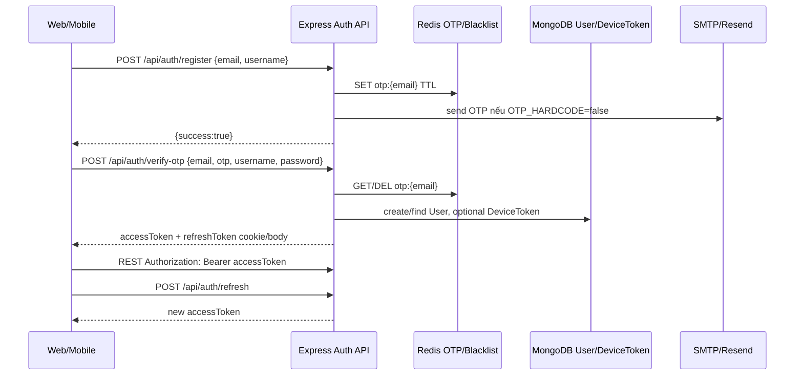
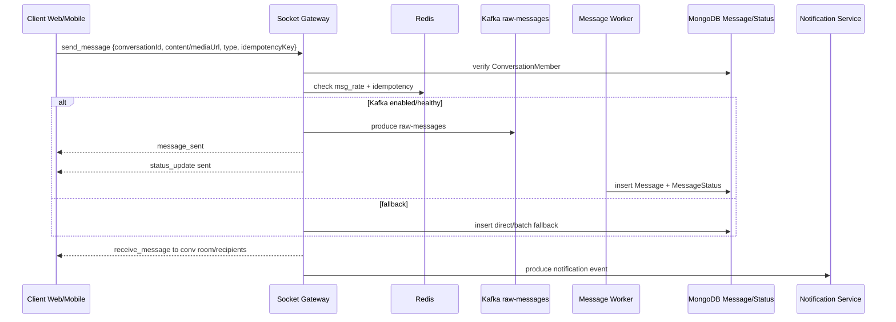
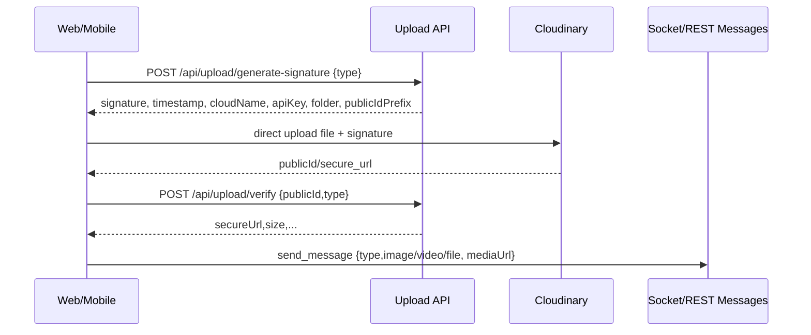
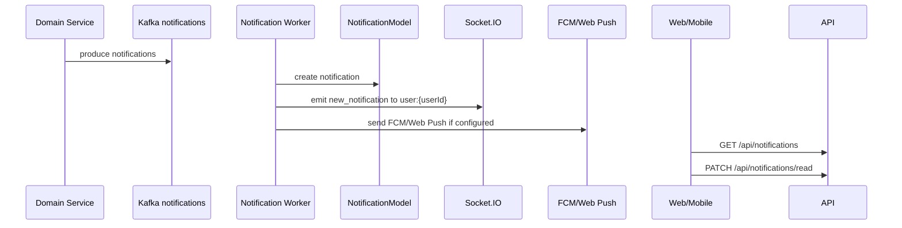
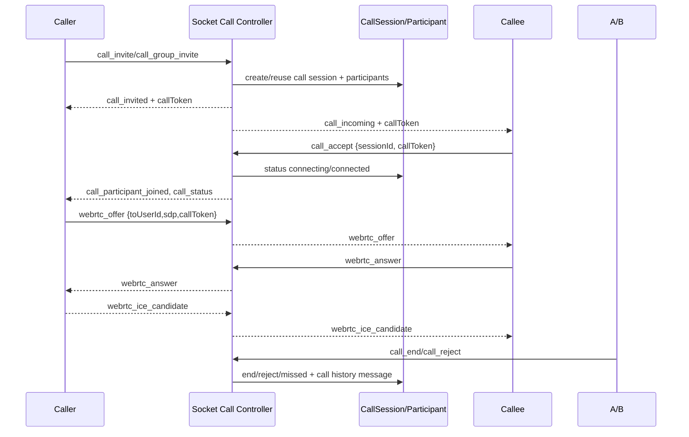

# 01. Architecture

## Kiến trúc tổng thể

Zync là monorepo npm workspaces:

- `apps/server`: Express modular monolith, Socket.IO gateway, Kafka workers.
- `apps/web`: Next.js App Router web client.
- `apps/mobile`: Expo/React Native mobile client.
- `packages/shared-types`: TypeScript contract dùng chung.
- `infra`: Docker compose cho Redis, Redpanda, coturn.

Backend không phải microservices độc lập. Các module tách theo domain nhưng cùng process, cùng MongoDB, cùng Redis/Kafka client. Worker cũng chạy từ `apps/server/src/main.ts` khi `KAFKA_ENABLED=true`.

## Thành phần và lý do tồn tại

| Thành phần | Lý do tồn tại | File |
| --- | --- | --- |
| Express app | REST API, middleware, route mount | `apps/server/src/app.ts` |
| Socket gateway | realtime chat, presence, call signaling | `apps/server/src/socket/gateway.ts` |
| Redis | presence, typing TTL, idempotency cache, rate limit, socket adapter | `apps/server/src/infrastructure/redis.ts` |
| Kafka/Redpanda | xử lý async message insert, notification, AI embedding/catchup | `apps/server/src/infrastructure/kafka.ts` |
| MongoDB | dữ liệu nghiệp vụ chính | `apps/server/src/modules/**/*.model.ts` |
| Neon pgvector | semantic search/vector embeddings | `apps/server/src/infrastructure/neon.ts` |
| Cloudinary | upload media trực tiếp từ client bằng signature | `apps/server/src/modules/upload` |
| Web Push/FCM | notification ngoài app | `apps/server/src/workers/notification.worker.ts` |
| TURN/coturn | NAT traversal cho WebRTC | `infra/docker-compose.yml` |

## Auth flow



File liên quan:

- `apps/server/src/modules/auth/auth.routes.ts`
- `apps/server/src/modules/auth/auth.controller.ts`
- `apps/server/src/modules/auth/auth.service.ts`
- `apps/server/src/modules/auth/otp.service.ts`
- `apps/web/src/services/auth.ts`
- `apps/web/src/services/api.ts`
- `apps/mobile/src/services/auth.ts`
- `apps/mobile/src/services/api.ts`

## Chat message flow



File liên quan:

- `apps/server/src/socket/chat.controller.ts`
- `apps/server/src/socket/gateway.ts`
- `apps/server/src/modules/messages/messages.service.ts`
- `apps/server/src/workers/message.worker.ts`
- `apps/server/src/modules/notifications/notifications.service.ts`

## Upload media flow



File liên quan:

- `apps/server/src/modules/upload/upload.routes.ts`
- `apps/server/src/modules/upload/upload.controller.ts`
- `apps/server/src/modules/upload/upload.service.ts`
- `apps/web/src/services/upload.ts`
- `apps/web/src/components/home-dashboard/molecules/message-input.tsx`
- `apps/mobile/app/chat-room.tsx`

## Notification flow



File liên quan:

- `apps/server/src/modules/notifications/notifications.service.ts`
- `apps/server/src/workers/notification.worker.ts`
- `apps/server/src/socket/gateway.ts`
- `apps/web/src/hooks/use-notifications.ts`
- `apps/mobile/src/context/notifications-context.tsx`

## WebRTC call flow



File liên quan:

- `apps/server/src/socket/call.controller.ts`
- `apps/server/src/modules/calls/calls.service.ts`
- `apps/server/src/modules/calls/calls.model.ts`
- `apps/web/src/stores/call-store.ts`
- `apps/mobile/src/hooks/useVideoCall.ts`

## AI / moderation / search flow

```mermaid
flowchart TD
  M[New message] --> MQ[Kafka message-embeddings]
  MQ --> EW[Message Embedding Worker]
  EW --> Neon[(Neon pgvector message_embeddings)]
  U[User query] --> API[/api/ai/assistant/search or /api/ai/search/messages]
  API --> Neon
  API --> Mongo[(Mongo messages/conversations)]

  C[Create catchup/group note] --> Jobs[Kafka ai-catchup-jobs]
  Jobs --> CW[Catchup/Assistant Worker]
  CW --> AI[Gemini/OpenRouter]
  CW --> MongoAI[(AiCatchupDigest/AiAssistantItem/AiGroupNote)]
  CW --> Sock[ai_*_updated socket event]

  Msg[Message content] --> Mod[Moderation service/worker]
  Mod --> AI
  Mod --> Log[(ModerationLog)]
  Mod --> Action[content_blocked/message_recalled/user_penalty_updated]
```

File liên quan:

- `apps/server/src/modules/ai`
- `apps/server/src/modules/ai/embeddings/message-embedding.worker.ts`
- `apps/server/src/modules/ai/catchup/catchup.worker.ts`
- `apps/server/src/modules/ai/workers/ai-assistant.worker.ts`
- `apps/server/src/modules/ai/moderation/moderation.service.ts`
- `apps/server/src/infrastructure/neon.ts`

## Rủi ro kiến trúc

- `apps/server/src/socket/gateway.ts` có cả phần delegate controller và nhiều handler legacy/duplicate sau đó; cần cẩn thận khi refactor để không sửa nhầm code không còn được gọi.
- `moderationAdminRouter` được định nghĩa nhưng chưa mount trong `app.ts`; route comment `/api/admin/moderation` không hoạt động theo code hiện tại.
- `users.routes.ts` đặt `/:userId` trước `/presence/bulk`, làm `GET /api/users/presence/bulk` có thể bị route `/:userId` bắt trước.
- Message flow vừa có Kafka vừa fallback direct insert; cần giữ idempotency và status mapping đồng bộ Web/Mobile.
