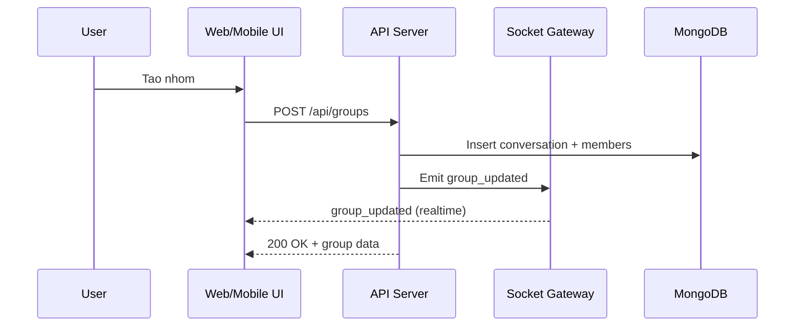
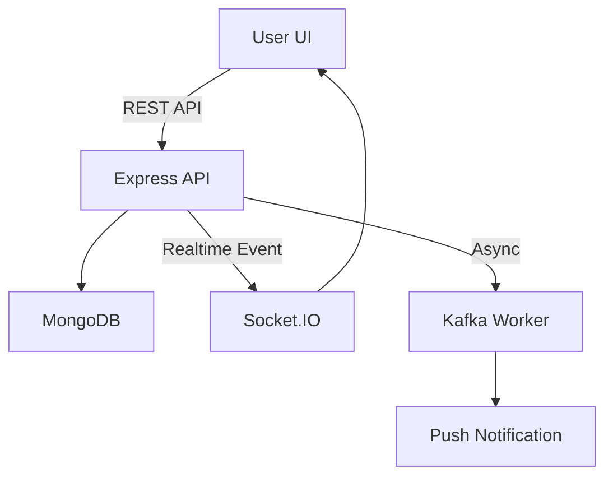

# Thuyet trinh nghiep vu: Quan ly nhom va quan ly cong dong (Zync Platform)

Tai lieu nay tong hop nghiep vu, luong xu ly, va ky thuat cho 2 chuc nang chinh: Quan ly nhom va Quan ly cong dong. Noi dung phu hop de thuyet trinh va bao cao tong quan.

---

## 1) Tong quan he thong va muc tieu

**Muc tieu:** Xay dung nen tang nhan tin thoi gian thuc, co kha nang trao doi 1-1/nhom va khong gian cong dong de nguoi dung dang tai, chia se va tuong tac.

**Nen tang hien tai:**
- Backend: Node.js 20 + Express + Socket.IO
- Database: MongoDB 7 (Mongoose)
- Cache/Realtime: Redis 7 (Pub/Sub, presence, cache)
- Queue: Kafka (Redpanda local)
- Web: Next.js 14 (App Router)
- Mobile: React Native (Expo)
- Media: Cloudinary (signed upload)
- Auth: JWT + OTP

---

## 2) Chuc nang A: Quan ly nhom

### 2.1 Muc tieu nghiep vu
- Tao nhom de chat, chia se, va quan ly thanh vien theo phan quyen.
- Toi da 100 thanh vien/nhom.
- Ho tro cap nhat thong tin nhom, them/xoa thanh vien, roi nhom, giai tan nhom.

### 2.2 Tac nhan va vai tro
- **Nguoi tao nhom (Owner):** quyen quan tri cao nhat.
- **Thanh vien (Member):** tham gia, roi nhom.
- **Admin (hien thi vai tro):** vai tro hien thi trong UI (khong toan quyen quan ly trong rule hien tai).

### 2.3 Quy tac nghiep vu chinh (hien tai)
- Chi **owner** duoc them/xoa thanh vien, thay doi vai tro, va giai tan nhom.
- Cap nhat ten/anh dai dien nhom: **bat ky thanh vien hien tai** co the cap nhat (rule hien tai).
- Moi thao tac quan tri phai xac thuc membership.
- Khi nhom thay doi, phat su kien realtime `group_updated` de dong bo UI.

### 2.4 Doi tuong du lieu (tom tat)
- **Conversation (group):** thong tin nhom (ten, avatar, privacy, createdBy)
- **ConversationMember:** thanh vien + vai tro
- **Message:** tin nhan nhom

### 2.5 Luong nghiep vu chinh

#### a) Tao nhom
1. User mo man hinh tao nhom
2. Nhap ten/anh/che do (cong khai/kin)
3. Gui `POST /api/groups`
4. Backend validate, tao conversation + membership
5. Tra ve nhom moi, UI chuyen vao nhom

#### b) Them thanh vien
1. Owner chon them thanh vien
2. Gui yeu cau them (API)
3. Backend kiem tra owner, them vao `conversation_members`
4. Phat `group_updated` de cap nhat client

#### c) Xoa thanh vien / Giai tan nhom
1. Owner thuc hien thao tac
2. Backend kiem tra quyen owner
3. Cap nhat DB
4. Phat `group_updated` va cap nhat UI

### 2.6 Realtime flow (Socket.IO)

### 2.7 Ky thuat va cong nghe lien quan
- **API:** REST (Express) + middleware auth
- **Realtime:** Socket.IO + Redis adapter
- **Luu tru:** MongoDB (conversation + members)
- **Bao mat:** JWT + auth middleware
- **Media:** Cloudinary signed upload (avatar nhom)

---

## 3) Chuc nang B: Quan ly cong dong

### 3.1 Muc tieu nghiep vu
- Cung cap khong gian cong dong de nguoi dung dang bai, chia se noi dung, va tuong tac.
- Ho tro newsfeed, thong bao, va realtime update noi dung.

### 3.2 Tac nhan
- **Nguoi dang bai (Author)**
- **Nguoi doc/tuong tac (Viewer)**

### 3.3 Doi tuong du lieu (tom tat)
- **Post:** bai viet (noi dung, media, privacy, author)
- **Comment:** binh luan
- **Media:** file dinh kem (image/video)

### 3.4 Luong nghiep vu chinh

#### a) Dang bai
1. User mo man hinh tao bai
2. Nhap noi dung, dinh kem (tuy chon)
3. Gui `POST /posts`
4. Backend validate, luu DB
5. Tra ve bai viet moi, cap nhat newsfeed

#### b) Xem newsfeed
1. UI goi API lay danh sach bai viet
2. Hien thi theo thu tu moi nhat
3. Tuong tac (like/comment) cap nhat lai giao dien

### 3.5 Realtime + thong bao
- Khi co bai viet moi, he thong co the phat su kien realtime va thong bao (notification) toi nguoi dung lien quan.
- Notification worker tu Kafka co the gui push khi nguoi dung offline.

### 3.6 Ky thuat va cong nghe lien quan
- **API:** REST (Express)
- **Storage:** MongoDB
- **Realtime/Notify:** Socket.IO + Kafka workers + FCM/APNs
- **Media:** Cloudinary signed upload
- **Web/Mobile UI:** Next.js + React Native (Expo)

---

## 4) Thiet ke flow tong quan (2 chuc nang)

---

## 5) Diem nhan de thuyet trinh
- **Nghiep vu ro rang:** nhom (membership + quyen) va cong dong (bai viet + newsfeed).
- **Realtime:** su dung Socket.IO + Redis adapter de dong bo trang thai.
- **Chia tach trach nhiem:** API xu ly business, worker xu ly push/async.
- **Mo rong de dang:** day la co so de mo rong moderation, bao cao vi pham, va KPI theo tung nhom/cong dong.

---

## 6) Pham vi mo rong (tuong lai)
- Kiem duyet noi dung (moderation) va chinh sach vi pham.
- Quan ly vai tro nang cao (admin/co-admin), quy trinh duyet thanh vien.
- Cong dong theo chu de, hashtag va xu huong.
- Thong ke hoat dong nhom (active members, engagement).
