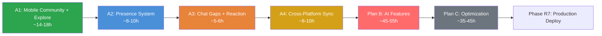

# ZYNC Platform: Unified Implementation Roadmap

**Ngày lập:** 02/05/2026
**Cập nhật lần cuối:** 05/05/2026
**Mục tiêu:** Hoàn thiện tính năng Web/Mobile + Tích hợp AI thông minh.

---

## Tổng tiến độ

| Phase | Trạng thái | Ghi chú |
|-------|-----------|---------|
| Phase R1: UX Redesign | ✅ Hoàn thành | |
| Phase R2: Mobile App Parity | ✅ Hoàn thành | |
| Phase R3: Mobile Video Call | ✅ Hoàn thành | 26/04/2026 |
| Phase R4: Pivot Branding | ✅ Hoàn thành | |
| Phase N1: Community Posts (Web) | ✅ Hoàn thành | |
| Phase N3: Explore & Discovery | ✅ Hoàn thành | |
| **Phase X: Backend Refactoring** | **✅ Hoàn thành** | **04/05/2026** |
| **Plan A: Feature Parity Web + Mobile** | ⏳ Sắp tới | ~42-52h |
| Plan B: AI Features | ⏳ Sắp tới | ~45-55h |
| Plan C: Optimization + Hardening | ⏳ Sắp tới | ~35-45h |
| Phase R7: Production Deploy | ⏳ Sắp tới | |

---

## Hoàn thành: Phase X – Backend Refactoring (✅ 04/05/2026)

### Backend Refactoring (Critical)
- [x] **IoC Container (Awilix):** Cài `awilix`, tạo `src/container.ts`, đăng ký Repositories dưới dạng Singleton.
- [x] **Repository Pattern:** Tạo `BaseRepository`, `MessageRepository`, `PostRepository`, `CommentRepository`. Service đã migrate.
- [x] **Schema-driven Validation:** `Zod` + `validate.middleware.ts` hoạt động.
- [x] **Global Error Handler:** `error-handler.middleware.ts` chuẩn hoá 5 loại lỗi (AppError, Zod, MongoDB, JWT, Unknown).
- [x] **Migrate MessagesService:** Inject `MessageRepository`, repo methods thay thế direct model queries.
- [x] **Migrate PostsService:** Inject `PostRepository + CommentRepository`, repo methods thay thế direct model queries.

### Infrastructure Optimization
- [x] **Kafka DLQ & Retry:** Topics `raw-messages.retry` + `raw-messages.dlq` + `notifications.retry` + `notifications.dlq`. Max 3 retries với exponential backoff.
- [x] **Socket Modularization – Call:** Tách Call + WebRTC events (8 handlers) ra `call.controller.ts`.
- [x] **Socket Modularization – Chat:** Tách `send_message`, `message_read`, `message_delivered`, `delete_message_for_me`, `recall_message`, `forward_message` ra `chat.controller.ts`. `gateway.ts` giảm từ 2184 → **2061 dòng**.
- [x] **Socket Modularization – Reaction:** Tách `reaction_upsert`, `reaction_remove_all_mine` ra `reaction.controller.ts`. `gateway.ts` giảm thêm ~370 dòng, còn **~1300 dòng**.

---

## Giai đoạn 2: Hoàn thiện tính năng (Plan A – Feature Parity Web + Mobile)

> **File chi tiết:** `zync_plan/plan_A_feature_completion.md`
> **Effort:** ~42-52h
> **Ưu tiên:** 🔴 P0 – Phải hoàn thành trước Phase R7

### 2.1. A1: Mobile Community & Explore (~14-18h)
- [ ] **A1.1:** Community Posts trên Mobile (Community tab, PostCard, CreatePostSheet, CommentSheet, post-detail)
- [ ] **A1.2:** Explore & Discovery trên Mobile (tìm kiếm kênh, developer, bài viết trending)
- [ ] **A1.3:** Refactor tab navigator Mobile (thêm tab Cộng đồng)

### 2.2. A2: Presence & Status System (~8-10h)
- [ ] **A2.1:** Backend presence (Redis heartbeat, broadcast cho friends, API `/api/users/:id/presence`)
- [ ] **A2.2:** Web presence UI (green dot, "Hoạt động X phút trước")
- [ ] **A2.3:** Mobile presence UI (green dot, lastSeen)

### 2.3. A3: Chat Feature Gaps (~5-6h)
- [ ] **A3.1:** Push notification client Mobile (expo-notifications + FCM/APNs)
- [ ] **A3.2:** Mutual friends hiển thị + Friend list trong profile Mobile
- [ ] **A3.3:** Chuẩn hoá reaction contract (`reaction_updated` thống nhất giữa Web/Mobile) — đang làm

### 2.4. A4: Cross-Platform UI Sync (~8-10h)
- [ ] **A4.1:** Tạo `packages/shared-design/tokens.json` — source of truth design tokens
- [ ] **A4.2:** Đồng bộ `globals.css` (Web) ↔ `colors.ts` (Mobile) từ tokens.json
- [ ] **A4.3:** Đảm bảo navigation parity (tất cả mục trên Web có trên Mobile)
- [ ] **A4.4:** Responsive + Accessibility (dark mode, font scaling, safe area)

---

## Giai đoạn 3: AI Intelligence & Personalization (Plan B – ~45-55h)

> **File chi tiết:** `zync_plan/plan_B_ai_features.md`

- [ ] **B1: Semantic Search (AI-2):** Embedding worker + Hybrid search (MongoDB text + pgvector cosine) + Gemini re-rank (~12-15h)
- [ ] **B2: AI Personal Assistant (gộp R5 + AI-3):** Context builder + 8 function calling + UI chat Web/Mobile (~18-22h)
- [ ] **B3: Developer DNA (N2):** Batch analysis + Radar chart + AI badges + Personality + Share card (~15-18h)

---

## Giai đoạn 4: Tối ưu & Phát hành (Plan C – ~35-45h)

> **File chi tiết:** `zync_plan/plan_C_system_optimization.md`

### C1: Performance Optimization (~10-12h)
- [ ] MongoDB atomic unread count (`$inc` thay read-modify-write loop)
- [ ] Redis pipeline cho presence operations
- [ ] Compound index `{conversationId:1, createdAt:-1, _id:-1}` cho messages
- [ ] Lazy join conversation rooms
- [ ] Image lazy loading + WebP format

### C2: Security Hardening (~8-10h)
- [ ] XSS sanitization cho message + post content (package `xss`)
- [ ] Helmet CSP strict mode
- [ ] CORS strict cho production domains
- [ ] Rate limit per-conversation (chống spam)
- [ ] AI prompt injection hardening (15+ adversarial vectors)

### C3: Code Quality & Testing (~10-12h)
- [ ] Error code standardization (AUTH_001, MSG_002, POST_001, AI_001)
- [ ] Chuẩn hoá reaction contract (thống nhất `reaction_updated` giữa Web/Mobile)
- [ ] Unit test coverage >= 60%
- [ ] Integration test: API + Socket + Kafka mock
- [ ] Load test: 500 CCU, 200 msg/s (Artillery/K6)

### C4: Documentation & Observability (~7-10h)
- [ ] Swagger/OpenAPI auto-gen từ Zod schemas
- [ ] Deep health check `/health/ready` (MongoDB/Redis/Kafka/Neon/Gemini)
- [ ] Brand cleanup: đổi "Zalo Clone" → "ZYNC Dev Community" toàn hệ thống
- [ ] Prometheus metrics + Grafana dashboard

---

## Thứ tự thực hiện đề xuất

> **A1 (Mobile Community) phải làm đầu tiên** vì đây là gap lớn nhất — Web đã có đầy đủ nhưng Mobile hoàn toàn trống.

---

## Chi phí Dev Stack (toàn bộ $0)

| Service | Plan | Chi phí |
|---------|------|---------|
| MongoDB Atlas | M0 (free) | $0 |
| Redis | Docker local (~5MB) | $0 |
| Kafka/Redpanda | Docker local (~150MB) | $0 |
| Cloudinary | Free (25 credits/tháng) | $0 |
| Resend/Gmail SMTP | Free tier | $0 |
| Neon PostgreSQL | Free (0.5GB, 190h compute/tháng) | $0 |
| Google Gemini API | Free (15 RPM, 1M tokens/ngày) | $0 |
